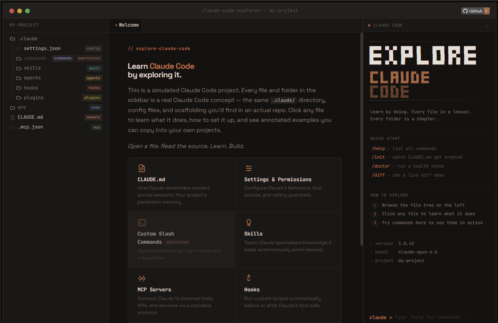

<p align="center">
  
</p>

<p align="center">
  <strong>Learn Claude Code by exploring it.</strong>
</p>

<p align="center">
  <a href="https://exploreclaudecode.com"></a>
  <a href="https://github.com/LukeRenton/explore-claude-code/blob/main/LICENSE"></a>
  <a href="https://github.com/LukeRenton/explore-claude-code/stargazers"></a>
  
</p>

---

A simulated Claude Code project you can click through. Every file and folder in the sidebar is a real Claude Code concept — the same `.claude/` directory, config files, and scaffolding you'd find in an actual repo. Click any file to learn what it does, how to set it up, and see annotated examples you can copy into your own projects.

<p align="center">
  
</p>

## What You'll Learn

| Folder / File | Feature |
|---|---|
| `CLAUDE.md` | Project memory — context that persists across sessions |
| `.claude/settings.json` | Configuring permissions, tool access, and guardrails |
| `.claude/commands/` | Custom slash commands — saved workflows you can invoke |
| `.claude/skills/` | Skills — knowledge folders Claude loads autonomously |
| `.claude/agents/` | Subagents for specialised, delegated tasks |
| `.claude/hooks/` | Lifecycle hooks — shell scripts that run on Claude events |
| `.claude/plugins/` | Plugins — extend Claude with custom tools and resources |
| `.mcp.json` | MCP server configuration for external tool integrations |
| `src/` | Example source code showing config alongside a real project |

Each file's content *is* the config — self-describing boilerplate that explains itself.

## Try It

**[exploreclaudecode.com](https://exploreclaudecode.com)** — no install needed.

Or run locally:

```bash
git clone https://github.com/LukeRenton/explore-claude-code.git
cd explore-claude-code

# Any static server works
npx serve site
# or
python -m http.server -d site 8080
# or just open site/index.html directly
```

## Project Structure

```
explore-claude-code/
├── site/
│   ├── index.html            # Single-page app entry
│   ├── data/
│   │   └── manifest.json     # All tree structure + content (drives entire UI)
│   ├── content/              # Source markdown & config files
│   ├── js/
│   │   ├── app.js            # Main controller
│   │   ├── file-explorer.js  # Sidebar tree with canvas connectors
│   │   ├── content-loader.js # Markdown renderer
│   │   ├── terminal.js       # Interactive terminal panel
│   │   ├── progress.js       # Feature completion tracker
│   │   └── icons.js          # SVG icon library
│   └── css/                  # Split by concern (variables, layout, components, syntax, terminal, void)
├── logo.png
└── README.md
```

## Contributing

Contributions welcome — especially for:

- New content as Claude Code adds features
- Accessibility improvements
- Mobile experience refinements

Content lives in `site/data/manifest.json` and `site/content/`. The manifest drives the tree structure, badges, and feature groupings. Each node's `contentFile` points to a markdown or JSON file in `content/`.

## License

[MIT](LICENSE)
